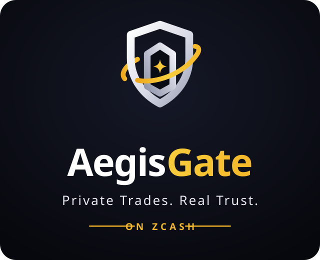

<p align="center"></p>

# Aegis Gate

**Live:** https://aegis-gate-zec.vercel.app

**Private escrow for strangers, on shielded Zcash.** ZECATHON · Wildcard track

Zcash has no smart contracts, so it has no escrow. Every private trade between two people
who don't know each other is "you send first and hope." Aegis Gate fixes that without a
custodian and without ever leaving the shielded pool:

- Buyer, seller and an arbiter each hold one share of a **2-of-3 FROST key**
  ([ZIP 312](https://zips.z.cash/zip-0312)). No single party can move the funds, Aegis included.
- That key controls an **Ironwood** shielded address. Amount, parties and item never
  appear on-chain.
- Normal trade: buyer + seller co-sign the release. The arbiter never gets involved.
- Dispute: the arbiter co-signs with whichever side is right.

This makes a shielded transaction *worth making*: it is the payment in a real trade
between strangers, protected without trusting anyone. Aegis Gate is the trust layer of
**Aegis Market**, a private marketplace built on it.

## What works today (proven on Zcash testnet, post-NU7)

| Step | Status | Evidence |
|---|---|---|
| 2-of-3 RedPallas FROST DKG between buyer, seller, arbiter over an encrypted relay | ✅ | `poc/escrow.sh dkg` |
| Escrow address + viewing key derived **independently by all three parties**, byte-identical | ✅ | `poc/escrow.sh escrow`, pinned by test |
| Escrow funded on Ironwood, watched view-only (no one holds the spending key) | ✅ | tx `669e43e2fb27cf15f7a0eb098eb17efe56dc3bd8b3443abc656697359bcdcfef`, block 4,465,795 |
| Buyer + seller FROST signature verified against `rk = ak + [α]G` (the consensus check) | ✅ | `aegis verify-sig` |
| Release: PCZT built → proven → 2-of-3 FROST signed → broadcast on Ironwood | ✅ | tx `1b980aaa5dfd2ee811f824688c7c5b264aaa1b87aa940dddc99d3697b11e8bdf`, block 4,465,954: 0.10 TAZ to the seller |
| Full deal through the web app: create → fund → buyer + seller approve → 2-of-3 payout | ✅ | tx `af093f5660469a67369d776a45674b17971a16f96f4231f6196800fc095f4526`, block 4,466,046 |
| **Self-custody release in a real browser**: buyer and seller FROST shares made and kept in their browsers (WebAssembly); engine holds only the arbiter's share | ✅ | tx `bf754298f5d01723ab04f936461677c48d31f711ea3a910b51cb4a16044a5447`, block 4,466,532 |
| **Dispute → refund** by buyer (browser key) + arbiter, completed after a deliberate engine crash mid-payout, no funds lost | ✅ | tx `ae74bc7347d3960fefb6740db7b2a77f66771831b35cc88cd64a0e442cc4addf`, block 4,466,552 |
| Forged / malformed / tampered signatures rejected | ✅ | `cargo test` (7 + 4 tests), `apps/engine/signer-selftest.mjs` |
| 22 error paths refused (bad input, wrong links, early or single-signer payouts, plain-text key shares, disagreeing keys) | ✅ | `node apps/engine/test-errors.mjs` |
| Browser refuses to sign a payout to an address not agreed for the outcome | ✅ | tested in the real browser |

Testnet activated **NU7 at height 4,465,026**, hours before this escrow was funded. No
released Zcash tooling could build NU7 transactions yet, so this repo pins librustzcash
`9c5705f` (2 Oct 2026) and ships a port of `zcash-devtool` to it
([`patches/zcash-devtool-nu7.patch`](patches/zcash-devtool-nu7.patch)).

## How it works

```
 buyer ─┐                            ┌─ escrow address (Ironwood, Orchard-protocol receiver)
 seller ├─ FROST DKG (via relay) ──► │  ak = FROST group key, nobody holds ask
 arbiter┘                            └─ UFVK, recomputed by every party from (ak, deal id)

 release / refund / dispute:
 PCZT (create + prove) ─► aegis inspect ─► sighash + randomizer α per spend
                          ─► FROST rounds, any 2 of 3 ─► aegis apply (checks each sig) ─► broadcast
```

- **Verifiable escrow.** The viewing components (`nk`, `rivk`) are derived from
  `BLAKE2b(ak || deal_id)`, so every participant computes the same escrow address and can
  check it is the one they agreed to. No one has to be trusted to hand out the UFVK.
  [`packages/core/src/escrow.rs`](packages/core/src/escrow.rs)
- **External signing.** `aegis inspect` extracts exactly what the FROST group must sign.
  `aegis apply` injects the signatures and verifies each against its `rk`, so a bad
  signature fails locally, before broadcast.
  [`packages/core/src/signing.rs`](packages/core/src/signing.rs)

## Reproduce

Requirements: Rust stable, Python 3.11+, OpenSSL;
[`frost-tools`](https://github.com/ZcashFoundation/frost-tools) (`frostd`, `frost-client`);
[`zcash-devtool`](https://github.com/zcash/zcash-devtool) at `5a26ee8` with
`patches/zcash-devtool-nu7.patch` applied.

```bash
cargo test -p aegis-core
cargo build --release -p aegis-core
export AEGIS_BIN=/path/to/dir/with/frostd,frost-client,zcash-devtool
./poc/escrow.sh all                       # certs, relay, identities, DKG, escrow, view-only wallet
# fund the printed escrow address with testnet ZEC (faucet.testnet.valargroup.dev), then:
AEGIS_BIRTHDAY=<height before funding> ./poc/escrow.sh wallet
./poc/escrow.sh status
./poc/escrow.sh payout <seller-ua> <zatoshis> buyer seller    # normal release
./poc/escrow.sh payout <buyer-ua>  <zatoshis> arbiter buyer   # dispute → refund
```

## Roadmap (after this submission)

1. **Browser signer (WASM):** each party's key share lives only in their browser. The
   signer decodes the PCZT and shows "pay X ZEC to Y" before signing, never a bare hash.
2. **Deal flow web app:** seller creates a deal link; buyer joins, funds via a ZIP 321 QR
   from Zashi/Zodl; release/refund buttons; arbiter dashboard.
3. **Newcomer onboarding inside the deal:** wallet → get ZEC → shield → fund escrow, so a
   first shielded transaction is a real purchase, not a tutorial.
4. **Mainnet deals** with the community, each auditable through its escrow viewing key.

## Security

See [docs/THREAT_MODEL.md](docs/THREAT_MODEL.md): arbiter collusion, blind signing (being
fixed by the browser signer), viewing-key reach, quantum recoverability of FROST FVKs
(escrows are short-lived by design), relay metadata.

**Testnet prototype. Do not use with mainnet funds yet.**

## Credits

Signing logic adapts `zcash-sign` from ZcashFoundation/frost-tools (MIT OR Apache-2.0),
including its Ironwood v6 test fixture. FROST by the Zcash Foundation; PCZT, Ironwood and
NU7 support by the Zcash developers.

## License

MIT OR Apache-2.0
